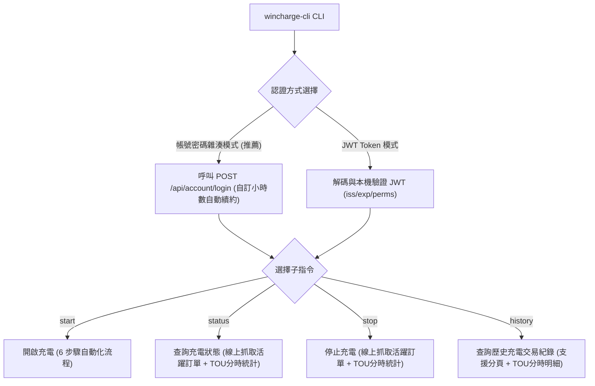
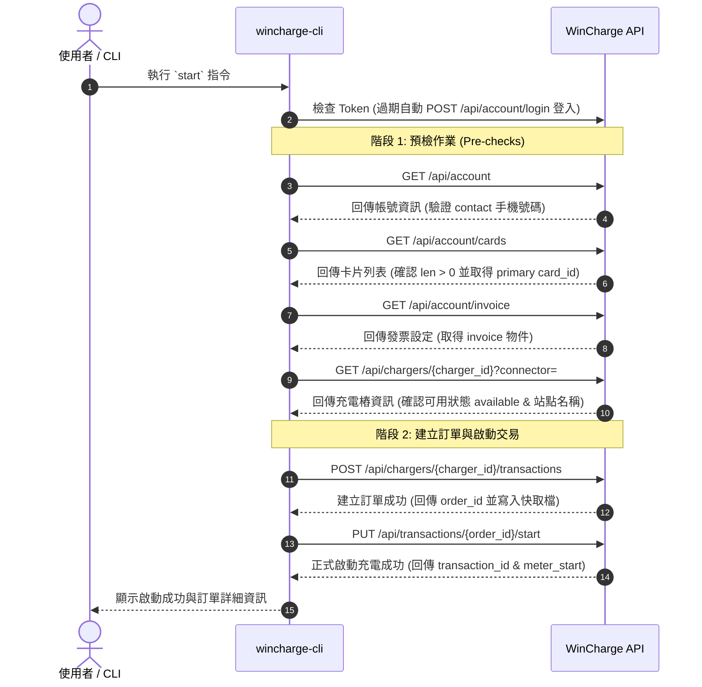

# WinCharge CLI 充電樁控制工具 (`wincharge-cli`)

[](https://github.com/shuangrain/wincharge-cli/actions/workflows/ci.yml)
[](https://github.com/shuangrain/wincharge-cli/releases)
[](https://github.com/hacs/default)

基於 **PEP 723 (Inline Script Metadata)** 規範與標準 Python Package 撰寫的充電樁 CLI 控制腳本與 **Home Assistant (HACS)** 自訂整合元件，支援自動安裝相依套件（如 `requests`），可用於自動化開啟充電、查詢充電進度、停止充電、時間電價分時統計與查詢歷史充電紀錄，並可完美整合至 **Home Assistant** 與 **Apple HomeKit / Siri** 進行智慧家庭語音與自動化控制。

> [!WARNING]
> **⚠️ 免責聲明 (Disclaimer)**  
> 本工具僅供個人技術測試、研究與教學交流使用。  
> 使用本工具進行任何 API 呼叫、充電作業所衍生之任何費用、設備損害或法律責任，開發者與貢獻者概不負任何形式之責任。請使用者確保在獲得適當授權之環境下使用。

---

## ⚡ 快速使用方式 (Quick Start)

無需複製 (clone) 專案即可透過 `uv` 或 `uvx` 獨立執行：

### 1. 帳號密碼雜湊自動登入模式 (最推薦 ⭐)
不再需要手動開啟瀏覽器 F12 開發者工具複製 JWT Token！直接傳入手機號碼與 F12 DevTools 擷取的 32 位 MD5 密碼雜湊，系統自動登入並維護自訂 Token 快取：

```bash
uvx --from git+https://github.com/shuangrain/wincharge-cli.git wincharge-cli --member-id "0911234567" --password-hash "YOUR_32HEX_MD5_HASH" history --count 5
```

### 2. 查詢充電狀態與時間電價分時明細 (`status`)
```bash
uvx --from git+https://github.com/shuangrain/wincharge-cli.git wincharge-cli --member-id "0911234567" --password-hash "YOUR_32HEX_MD5_HASH" status
```

### 3. 開啟 `--debug` 模式觀看 Raw HTTP Request / Response 封包
```bash
uvx --from git+https://github.com/shuangrain/wincharge-cli.git wincharge-cli --debug --member-id "0911234567" --password-hash "YOUR_32HEX_MD5_HASH" status
```

### 4. 輸出乾淨 JSON 格式 (適合 Home Assistant / 腳本串接)
```bash
uvx --from git+https://github.com/shuangrain/wincharge-cli.git wincharge-cli --json --member-id "0911234567" --password-hash "YOUR_32HEX_MD5_HASH" status
```

---

## 🏠 Home Assistant (HA) 整合與雙重動態輪詢指南

本專案原生支援 **HACS 自訂儲存庫 (Custom Repository)** 圖形化安裝、UI 自動登入驗證、**雙重動態輪詢 (Dual Dynamic Polling)** 與 **手動即時刷新按鈕**。

1. 開啟 Home Assistant 的 **HACS** 介面。
2. 點擊右上角三點選單 ➔ 選擇 **「Custom repositories (自訂儲存庫)」**。
3. 貼上儲存庫網址：`https://github.com/shuangrain/wincharge-cli`
4. 類別 (Category) 選擇 **`Integration (整合)`** ➔ 點擊 **ADD**。
5. 點擊搜尋到的 **WinCharge 充電樁控制** ➔ 點擊 **【下載 (Download)】**。
6. 重新啟動 Home Assistant。
7. 前往 **設定 ➔ 裝置與服務 ➔ 新增整合**，搜尋 **WinCharge**：
   - 輸入 **手機號碼 / 帳號 (`member_id`)**
   - 輸入 **登入密碼 32 位 MD5 雜湊 (`password_hash`)**
   - 輸入 **交易密碼 (`payment_password`)**
   - 輸入 **充電樁 ID (`charger_id`)**
   - 設定 **待命時重新整理間隔 (`idle_interval`)**（預設 60 秒）
   - 設定 **充電中重新整理間隔 (`charging_interval`)**（預設 10 秒）
   - 設定 **Token 登入快取續約週期 (`refresh_hours`)**（預設 24 小時）
8. 系統自動測試登入，建立感測器與控制按鈕：
   - ⚡ **【開始充電】按鈕** (`button.wincharge_start_btn`)
   - ⏹️ **【停止充電】按鈕** (`button.wincharge_stop_btn`)
   - 🔄 **【重新整理數據】按鈕** (`button.wincharge_refresh_btn`)：點擊立刻強制向 WinCharge API 抓取最新數據！

> [!TIP]
> **⚡ 雙重動態輪詢機制 (Dual Dynamic Polling)**  
> - 🟢 **待命狀態 (Idle)**：自動切換為低頻輪詢（預設 60 秒），節省 API 流量與伺服器負擔。  
> - ⚡ **充電狀態 (Charging)**：系統檢測到開始充電後，自動加速切換為高頻輪詢（預設 10 秒），充電曲線、度數與金額即時滑順更新！  
> - 🔄 **在畫面上看著時**：點擊卡片上的【重新整理數據】按鈕，立刻零延遲發送 API 抓取最新資訊！

---

## 🏗️ 系統架構 (Architecture & Subcommands)

本工具支援兩種認證模式（帳號密碼雜湊登入模式 / JWT 直連模式），四個子指令與 Debug / JSON 調試功能，架構如下：



---

## 🔐 認證與自訂 Token 自動續約機制

系統支援兩種彈性的認證方式：

1. **帳號密碼雜湊模式 (推薦)**：
   - 使用者提供 `member_id`（手機號碼）與 `password_hash`（直接輸入 32 位 MD5 雜湊值）。
   - 第一次呼叫 API 時自動執行 `POST /api/account/login` 取得 JWT `token` 與 `member_id` (UID)。
   - **Log 自動印出原廠 JWT Token 效期**（例如：`✅ [WinCharge] 帳號登入成功！(UID: U622089052065103882, Member ID: 0911234567, 原廠 JWT 效期至: 2046-08-09 15:30:00)`）。
   - 支援自訂快取續約週期 `--refresh-hours`（預設 24 小時），未滿設定小時數直接使用快取（0 次額外登入），滿設定小時數自動在背景重新登入並無感續約。

2. **Direct JWT Token 模式**：
   - 傳入原本的 `--api-key`、`--api-token` 與 `--api-uid`。
   - 腳本在發送網路請求前會自動檢查 JWT 結構、發行者 (`iss == wincharge.com`)、過期時間 (`exp`) 與權限 (`PERM_CHARGE_USER`)。

---

## ⚡ 開啟充電 (start) 完整順序圖

執行 `wincharge-cli start` 時，腳本會依序完成 6 個步驟：



---

## 🛠️ 環境需求

建議使用 [uv](https://github.com/astral-sh/uv) 執行：

```bash
# 安裝 uv (若尚未安裝)
curl -LsSf https://astral.sh/uv/install.sh | sh
```

---

## 🔑 環境變數設定 (選用)

可將常用的認證與密碼預先設為環境變數，執行時就不需每次手動傳入：

```bash
export WINCHARGE_MEMBER_ID="0911234567"
export WINCHARGE_PASSWORD_HASH="YOUR_32HEX_MD5_HASH"
export WINCHARGE_PAYMENT_PASSWORD="YOUR_PAYMENT_PASSWORD"
export WINCHARGE_REFRESH_HOURS="24"                        # 選用，自訂快取小時數
export WINCHARGE_CHARGER_ID="wincharge_ocppv16_SAMPLE123" # 選用
```

---

## 📄 參數說明

`uvx --from git+https://... wincharge-cli --help` 輸出範例：

```text
usage: wincharge-cli [-h] [--member-id MEMBER_ID] [--password-hash PASSWORD_HASH]
                     [--api-key API_KEY] [--api-token API_TOKEN]
                     [--api-uid API_UID] [--refresh-hours REFRESH_HOURS] [--debug] [--json]
                     {start,status,stop,history} ...

WinCharge 充電樁 CLI 控制工具 (PEP 723)

positional arguments:
  {start,status,stop,history}
                        可用的子指令
    start               開啟充電作業
    status              查詢充電狀態
    stop                停止充電作業
    history             查詢歷史充電紀錄

options:
  -h, --help            show this help message and exit
  --member-id MEMBER_ID
                        帳號/手機號碼 (可透過環境變數 WINCHARGE_MEMBER_ID 設定)
  --password-hash PASSWORD_HASH
                        登入密碼 32 位 MD5 雜湊值 (請直接輸入在瀏覽器 F12 DevTools 擷取的 32 位 MD5 雜湊值，也可透過 WINCHARGE_PASSWORD_HASH 設定)
  --api-key API_KEY     API Key (可透過環境變數 WINCHARGE_API_KEY 設定，預設已置入系統預設值)
  --api-token API_TOKEN
                        API Token (選填，可透過環境變數 WINCHARGE_API_TOKEN 設定)
  --api-uid API_UID     API UID (選填，可透過環境變數 WINCHARGE_API_UID 設定)
  --refresh-hours REFRESH_HOURS
                        自訂快取續約週期小時數 (預設: 24 小時，可透過環境變數 WINCHARGE_REFRESH_HOURS 設定)
  --debug               開啟 Debug 模式，印出完整的 Raw HTTP Request 與 Response 資訊
  --json                輸出乾淨的 JSON 格式 (適合 Home Assistant / 自動化腳本解析)
```
