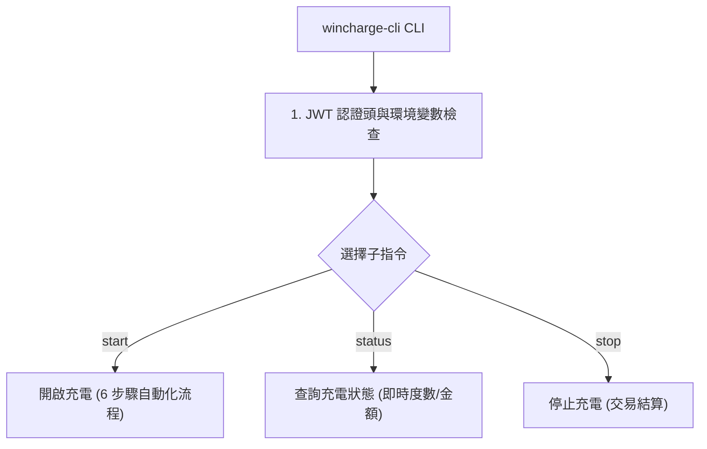
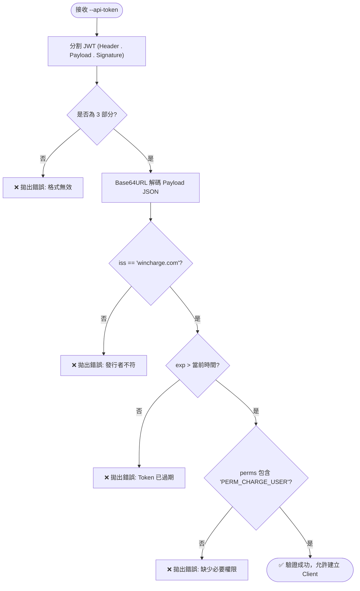
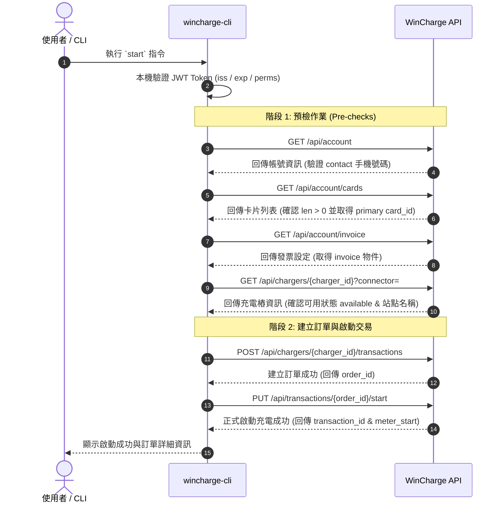

# WinCharge CLI 充電樁控制工具 (`wincharge-cli`)

[](https://github.com/shuangrain/wincharge-cli/actions/workflows/ci.yml)
[](https://github.com/shuangrain/wincharge-cli/releases)

基於 **PEP 723 (Inline Script Metadata)** 規範與標準 Python Package 撰寫的充電樁 CLI 控制腳本，支援自動安裝相依套件（如 `requests`），可用於自動化開啟充電、查詢充電進度與停止充電。

> [!WARNING]
> **⚠️ 免責聲明 (Disclaimer)**  
> 本工具僅供個人技術測試、研究與教學交流使用。  
> 使用本工具進行任何 API 呼叫、充電作業所衍生之任何費用、設備損害或法律責任，開發者與貢獻者概不負任何形式之責任。請使用者確保在獲得適當授權之環境下使用。

---

## ⚡ 快速使用方式 (Quick Start)

無需複製 (clone) 專案即可透過 `uv` 或 `uvx` 獨立執行：

### 1. 透過 `uvx` 整合 GitHub 專案執行 (最推薦)
```bash
uvx --from git+https://github.com/shuangrain/wincharge-cli.git wincharge-cli start
```

### 2. 開啟 `--debug` 模式觀看完整 Raw HTTP Request / Response
```bash
uvx --from git+https://github.com/shuangrain/wincharge-cli.git wincharge-cli --debug start
```

### 3. 本機 Clone 或下載單檔執行
```bash
uv run wincharge_cli.py --debug start
```

---

## 🏗️ 指令架構 (Subcommand Structure)

本工具支援三個主要子指令與 Debug 調試功能，架構如下：



---

## 🔒 JWT API Token 驗證流程

在發送任何網路請求前，腳本會自動對 `--api-token` 進行本機 JWT 解析與驗證：



---

## ⚡ 開啟充電 (start) 完整順序圖

執行 `wincharge-cli start` 時，腳本會依序完成 6 個步驟：



---

## 🛠️ 環境需求

建議使用 [uv](https://github.com/astral-sh/uv) 執行：

```bash
# 安裝 uv (若尚未安裝)
curl -LsSf https://astral.sh/uv/install.sh | sh
```

---

## 🔑 環境變數設定 (選用)

可將常用的認證與密碼預先設為環境變數，執行時就不需每次手動傳入：

```bash
export WINCHARGE_API_KEY="YOUR_API_KEY"
export WINCHARGE_API_TOKEN="YOUR_API_TOKEN"
export WINCHARGE_API_UID="YOUR_API_UID"
export WINCHARGE_PAYMENT_PASSWORD="YOUR_PAYMENT_PASSWORD"
export WINCHARGE_CHARGER_ID="wincharge_ocppv16_SAMPLE123" # 選用
```

---

## 📖 詳細指令說明與範例

### 1. 開啟充電 (`start`)

進行完整的預檢與啟動流程：

```bash
# 透過 uvx 遠端執行 (含 Debug 模式觀看 Raw Request / Response)
uvx --from git+https://github.com/shuangrain/wincharge-cli.git wincharge-cli \
  --debug \
  --api-key "YOUR_API_KEY" \
  --api-token "YOUR_API_TOKEN" \
  --api-uid "YOUR_API_UID" \
  start \
  --payment-password "YOUR_PAYMENT_PASSWORD" \
  --charger-id "wincharge_ocppv16_SAMPLE123"
```

**若本機執行單檔案：**

```bash
uv run wincharge_cli.py --debug start
```

---

### 2. 查詢充電狀態 (`status`)

查詢目前正在進行中的充電訂單狀態（充電度數、時間、目前費用等）：

```bash
uvx --from git+https://github.com/shuangrain/wincharge-cli.git wincharge-cli status 2400000000SAMPLE123
```

---

### 3. 停止充電 (`stop`)

發送停止充電交易指令：

```bash
uvx --from git+https://github.com/shuangrain/wincharge-cli.git wincharge-cli stop 2400000000SAMPLE123
```

---

## 📄 參數說明

`uvx --from git+https://... wincharge-cli --help` 輸出範例：

```text
usage: wincharge-cli [-h] [--api-key API_KEY] [--api-token API_TOKEN]
                     [--api-uid API_UID] [--debug]
                     {start,status,stop} ...

WinCharge 充電樁 CLI 控制工具 (PEP 723)

positional arguments:
  {start,status,stop}   可用的子指令
    start               開啟充電作業
    status              查詢充電狀態
    stop                停止充電作業

options:
  -h, --help            show this help message and exit
  --api-key API_KEY     API Key (可透過環境變數 WINCHARGE_API_KEY 設定)
  --api-token API_TOKEN
                        API Token (可透過環境變數 WINCHARGE_API_TOKEN 設定)
  --api-uid API_UID     API UID (可透過環境變數 WINCHARGE_API_UID 設定)
  --debug               開啟 Debug 模式，印出完整的 Raw HTTP Request 與 Response 資訊
```
